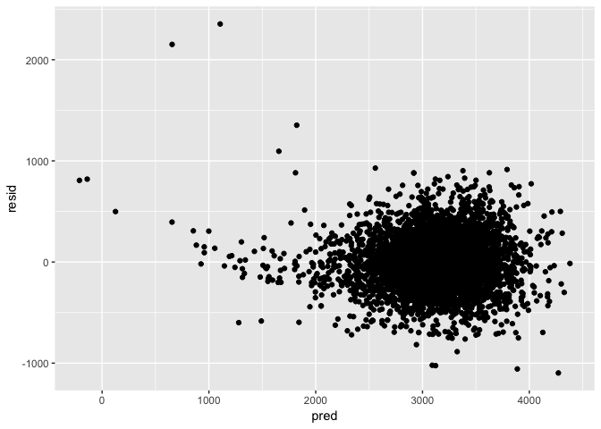
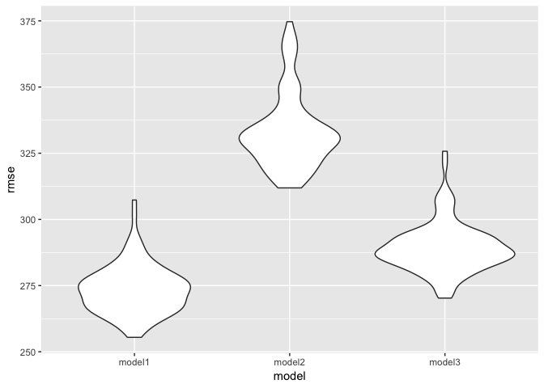

P8105\_hw6\_qs2200
================
Qi Shao
11/20/2018

Problem 1
---------

Tidy the data.

``` r
homi_df = read_csv("./data/homicide-data.csv") 
```

    ## Parsed with column specification:
    ## cols(
    ##   uid = col_character(),
    ##   reported_date = col_integer(),
    ##   victim_last = col_character(),
    ##   victim_first = col_character(),
    ##   victim_race = col_character(),
    ##   victim_age = col_character(),
    ##   victim_sex = col_character(),
    ##   city = col_character(),
    ##   state = col_character(),
    ##   lat = col_double(),
    ##   lon = col_double(),
    ##   disposition = col_character()
    ## )

``` r
homi_df = 
  homi_df%>%
  mutate(city_state = str_c(city, ", ", state)) %>%
  janitor::clean_names() %>%
  mutate(homi_solved= ifelse(disposition == "Closed by arrest", 1, 0)) %>%
  filter(!(city_state %in%c("Dallas, TX", "Phoenix, AZ", "Kansas City, MO", "Tulsa, AL"))) %>%
  mutate(victim_race = ifelse(victim_race == "White", "white", "non-white"), victim_age = as.integer(victim_age), victim_race = fct_relevel(victim_race, "white", "non-white")) 
```

    ## Warning in evalq(as.integer(victim_age), <environment>): NAs introduced by
    ## coercion

``` r
balti_model = homi_df %>%
  filter(city_state == "Baltimore, MD")

glm( homi_solved ~ victim_age + victim_sex + victim_race, data = balti_model, family = binomial()) %>%
broom::tidy() %>%
mutate(OR_estimate = exp(estimate), OR_conf_low = exp(estimate-qnorm(.975)*std.error), OR_conf_high = exp(estimate+qnorm(.975)*std.error)) %>%
filter(term == "victim_racenon-white") %>%
select(term,OR_conf_low, OR_estimate, OR_conf_high) %>% 
knitr::kable(digits = 3)
```

| term                  |  OR\_conf\_low|  OR\_estimate|  OR\_conf\_high|
|:----------------------|--------------:|-------------:|---------------:|
| victim\_racenon-white |          0.313|         0.441|            0.62|

The result of linear model shows that the adjusted odds ratio of solved homicides in which the victim is non-white estimated to be 0.441 times the odds ratio of homicides in which the victim is white.

``` r
each_city = homi_df %>%
  group_by(city_state) %>%
  nest()

odds_glm = function(df){
  glm( homi_solved ~ victim_age + victim_sex + victim_race, data = df, family =     binomial())  %>%
  broom::tidy() %>%
  mutate(OR_estimate = exp(estimate), OR_conf_low =        exp(estimate-qnorm(.975)*std.error), OR_conf_high = exp(estimate+qnorm(.975)*std.error)) %>%
  filter(term == "victim_racenon-white") %>%
  select(term,OR_conf_low, OR_estimate, OR_conf_high)
}

all_estimate = 
  mutate(each_city, or = map(data, odds_glm)) %>%
  select(city_state, or) %>%
  unnest() %>%
  select(-term)

all_estimate %>%
  mutate(city_state = fct_reorder(city_state, OR_estimate)) %>%
  ggplot(aes(x = city_state,y = OR_estimate)) + 
  geom_point() +
  geom_errorbar(aes(ymin = OR_conf_low,ymax = OR_conf_high))+
  geom_hline(yintercept = 1, alpha = 0.5, color = "red")+
  coord_flip()+
  theme_minimal()+
  labs(title = "Estimate and 95% CI of solving homicides odds ratio for each city", 
         x = "City and State", 
         y = "Solving homicides odds ratio comparing non-white victims to white victims") 
```


From the plot, we can see in most cities in the study, the estimate odds ratio of solving homicides comparing non-white victims to white victims is less than 1. It indicate that in most of the cities, homicides in which the victim is non-white are substantially less likely to be resolved that those in which the victim is white. There are also some cities in which CI of odds ratio including 1, and 3 of them have estimate odds ratio greater than 1. In these cities, homicides in which the victim is non-white are more likely to be resolved that those in which the victim is white.

Problem 2
---------

### Tidy the data

``` r
birthweight_df = read_csv("./data/birthweight.csv") 
```

    ## Parsed with column specification:
    ## cols(
    ##   .default = col_integer(),
    ##   gaweeks = col_double(),
    ##   ppbmi = col_double(),
    ##   smoken = col_double()
    ## )

    ## See spec(...) for full column specifications.

``` r
birthweight_df = janitor::clean_names(birthweight_df) %>%
  mutate(babysex = replace(babysex, babysex == 1, 'male'),
            babysex = replace(babysex, babysex == 2, 'female'),
            babysex = as_factor(babysex),
            frace = replace(frace, frace == 1, 'White'),
            frace = replace(frace, frace == 2, 'Black'),
            frace = replace(frace, frace == 3, 'Asian'),
            frace = replace(frace, frace == 4, 'Puerto Rican'),
            frace = replace(frace, frace == 8, 'Other'),
            frace = replace(frace, frace == 9, 'Unknown'),
            frace = as_factor(frace),
            malform = replace(malform, malform == 0, 'absent'),
            malform = replace(malform, malform == 1, 'present'),
            malform = as_factor(malform),
            mrace = replace(mrace, mrace == 1, 'White'),
            mrace = replace(mrace, mrace == 2, 'Black'),
            mrace = replace(mrace, mrace == 3, 'Asian'),
            mrace = replace(mrace, mrace == 4, 'Puerto Rican'),
            mrace = replace(mrace, mrace == 8, 'Other'),
            mrace = as_factor(mrace)) %>%
  dplyr::select(bwt, everything())

sum(is.na(birthweight_df))
```

    ## [1] 0

There are no missing value in this dataset.

### Propose a regression model

Use backward elimination method to build a regression model, take out non-significant variables one at a time.

``` r
mult.fit = lm( bwt ~ ., data = birthweight_df)
summary (mult.fit)
```

    ## 
    ## Call:
    ## lm(formula = bwt ~ ., data = birthweight_df)
    ## 
    ## Residuals:
    ##      Min       1Q   Median       3Q      Max 
    ## -1097.68  -184.86    -3.33   173.09  2344.15 
    ## 
    ## Coefficients: (3 not defined because of singularities)
    ##                     Estimate Std. Error t value Pr(>|t|)    
    ## (Intercept)       -6236.6841   660.1884  -9.447  < 2e-16 ***
    ## babysexmale         -28.7073     8.4652  -3.391 0.000702 ***
    ## bhead               130.7781     3.4523  37.881  < 2e-16 ***
    ## blength              74.9536     2.0217  37.075  < 2e-16 ***
    ## delwt                 4.1007     0.3948  10.386  < 2e-16 ***
    ## fincome               0.2898     0.1795   1.614 0.106551    
    ## fraceBlack           14.3313    46.1501   0.311 0.756168    
    ## fraceAsian           21.2361    69.2960   0.306 0.759273    
    ## fracePuerto Rican   -46.9962    44.6782  -1.052 0.292912    
    ## fraceOther            4.2969    74.0741   0.058 0.953745    
    ## gaweeks              11.5494     1.4654   7.882 4.06e-15 ***
    ## malformpresent        9.7650    70.6259   0.138 0.890039    
    ## menarche             -3.5508     2.8951  -1.226 0.220083    
    ## mheight               9.7874    10.3116   0.949 0.342588    
    ## momage                0.7593     1.2221   0.621 0.534418    
    ## mraceBlack         -151.4354    46.0453  -3.289 0.001014 ** 
    ## mraceAsian          -91.3866    71.9190  -1.271 0.203908    
    ## mracePuerto Rican   -56.4787    45.1369  -1.251 0.210901    
    ## parity               95.5411    40.4793   2.360 0.018307 *  
    ## pnumlbw                   NA         NA      NA       NA    
    ## pnumsga                   NA         NA      NA       NA    
    ## ppbmi                 4.3538    14.8913   0.292 0.770017    
    ## ppwt                 -3.4716     2.6121  -1.329 0.183913    
    ## smoken               -4.8544     0.5871  -8.269  < 2e-16 ***
    ## wtgain                    NA         NA      NA       NA    
    ## ---
    ## Signif. codes:  0 '***' 0.001 '**' 0.01 '*' 0.05 '.' 0.1 ' ' 1
    ## 
    ## Residual standard error: 272.5 on 4320 degrees of freedom
    ## Multiple R-squared:  0.7183, Adjusted R-squared:  0.717 
    ## F-statistic: 524.6 on 21 and 4320 DF,  p-value: < 2.2e-16

``` r
step1 = update(mult.fit, . ~ . -pnumsga)
summary(step1)
```

    ## 
    ## Call:
    ## lm(formula = bwt ~ babysex + bhead + blength + delwt + fincome + 
    ##     frace + gaweeks + malform + menarche + mheight + momage + 
    ##     mrace + parity + pnumlbw + ppbmi + ppwt + smoken + wtgain, 
    ##     data = birthweight_df)
    ## 
    ## Residuals:
    ##      Min       1Q   Median       3Q      Max 
    ## -1097.68  -184.86    -3.33   173.09  2344.15 
    ## 
    ## Coefficients: (2 not defined because of singularities)
    ##                     Estimate Std. Error t value Pr(>|t|)    
    ## (Intercept)       -6236.6841   660.1884  -9.447  < 2e-16 ***
    ## babysexmale         -28.7073     8.4652  -3.391 0.000702 ***
    ## bhead               130.7781     3.4523  37.881  < 2e-16 ***
    ## blength              74.9536     2.0217  37.075  < 2e-16 ***
    ## delwt                 4.1007     0.3948  10.386  < 2e-16 ***
    ## fincome               0.2898     0.1795   1.614 0.106551    
    ## fraceBlack           14.3313    46.1501   0.311 0.756168    
    ## fraceAsian           21.2361    69.2960   0.306 0.759273    
    ## fracePuerto Rican   -46.9962    44.6782  -1.052 0.292912    
    ## fraceOther            4.2969    74.0741   0.058 0.953745    
    ## gaweeks              11.5494     1.4654   7.882 4.06e-15 ***
    ## malformpresent        9.7650    70.6259   0.138 0.890039    
    ## menarche             -3.5508     2.8951  -1.226 0.220083    
    ## mheight               9.7874    10.3116   0.949 0.342588    
    ## momage                0.7593     1.2221   0.621 0.534418    
    ## mraceBlack         -151.4354    46.0453  -3.289 0.001014 ** 
    ## mraceAsian          -91.3866    71.9190  -1.271 0.203908    
    ## mracePuerto Rican   -56.4787    45.1369  -1.251 0.210901    
    ## parity               95.5411    40.4793   2.360 0.018307 *  
    ## pnumlbw                   NA         NA      NA       NA    
    ## ppbmi                 4.3538    14.8913   0.292 0.770017    
    ## ppwt                 -3.4716     2.6121  -1.329 0.183913    
    ## smoken               -4.8544     0.5871  -8.269  < 2e-16 ***
    ## wtgain                    NA         NA      NA       NA    
    ## ---
    ## Signif. codes:  0 '***' 0.001 '**' 0.01 '*' 0.05 '.' 0.1 ' ' 1
    ## 
    ## Residual standard error: 272.5 on 4320 degrees of freedom
    ## Multiple R-squared:  0.7183, Adjusted R-squared:  0.717 
    ## F-statistic: 524.6 on 21 and 4320 DF,  p-value: < 2.2e-16

``` r
step2 = update(step1, . ~ . -pnumlbw)
summary(step2)
```

    ## 
    ## Call:
    ## lm(formula = bwt ~ babysex + bhead + blength + delwt + fincome + 
    ##     frace + gaweeks + malform + menarche + mheight + momage + 
    ##     mrace + parity + ppbmi + ppwt + smoken + wtgain, data = birthweight_df)
    ## 
    ## Residuals:
    ##      Min       1Q   Median       3Q      Max 
    ## -1097.68  -184.86    -3.33   173.09  2344.15 
    ## 
    ## Coefficients: (1 not defined because of singularities)
    ##                     Estimate Std. Error t value Pr(>|t|)    
    ## (Intercept)       -6236.6841   660.1884  -9.447  < 2e-16 ***
    ## babysexmale         -28.7073     8.4652  -3.391 0.000702 ***
    ## bhead               130.7781     3.4523  37.881  < 2e-16 ***
    ## blength              74.9536     2.0217  37.075  < 2e-16 ***
    ## delwt                 4.1007     0.3948  10.386  < 2e-16 ***
    ## fincome               0.2898     0.1795   1.614 0.106551    
    ## fraceBlack           14.3313    46.1501   0.311 0.756168    
    ## fraceAsian           21.2361    69.2960   0.306 0.759273    
    ## fracePuerto Rican   -46.9962    44.6782  -1.052 0.292912    
    ## fraceOther            4.2969    74.0741   0.058 0.953745    
    ## gaweeks              11.5494     1.4654   7.882 4.06e-15 ***
    ## malformpresent        9.7650    70.6259   0.138 0.890039    
    ## menarche             -3.5508     2.8951  -1.226 0.220083    
    ## mheight               9.7874    10.3116   0.949 0.342588    
    ## momage                0.7593     1.2221   0.621 0.534418    
    ## mraceBlack         -151.4354    46.0453  -3.289 0.001014 ** 
    ## mraceAsian          -91.3866    71.9190  -1.271 0.203908    
    ## mracePuerto Rican   -56.4787    45.1369  -1.251 0.210901    
    ## parity               95.5411    40.4793   2.360 0.018307 *  
    ## ppbmi                 4.3538    14.8913   0.292 0.770017    
    ## ppwt                 -3.4716     2.6121  -1.329 0.183913    
    ## smoken               -4.8544     0.5871  -8.269  < 2e-16 ***
    ## wtgain                    NA         NA      NA       NA    
    ## ---
    ## Signif. codes:  0 '***' 0.001 '**' 0.01 '*' 0.05 '.' 0.1 ' ' 1
    ## 
    ## Residual standard error: 272.5 on 4320 degrees of freedom
    ## Multiple R-squared:  0.7183, Adjusted R-squared:  0.717 
    ## F-statistic: 524.6 on 21 and 4320 DF,  p-value: < 2.2e-16

``` r
step3 = update(step2, . ~ . -wtgain)
summary(step3)
```

    ## 
    ## Call:
    ## lm(formula = bwt ~ babysex + bhead + blength + delwt + fincome + 
    ##     frace + gaweeks + malform + menarche + mheight + momage + 
    ##     mrace + parity + ppbmi + ppwt + smoken, data = birthweight_df)
    ## 
    ## Residuals:
    ##      Min       1Q   Median       3Q      Max 
    ## -1097.68  -184.86    -3.33   173.09  2344.15 
    ## 
    ## Coefficients:
    ##                     Estimate Std. Error t value Pr(>|t|)    
    ## (Intercept)       -6236.6841   660.1884  -9.447  < 2e-16 ***
    ## babysexmale         -28.7073     8.4652  -3.391 0.000702 ***
    ## bhead               130.7781     3.4523  37.881  < 2e-16 ***
    ## blength              74.9536     2.0217  37.075  < 2e-16 ***
    ## delwt                 4.1007     0.3948  10.386  < 2e-16 ***
    ## fincome               0.2898     0.1795   1.614 0.106551    
    ## fraceBlack           14.3313    46.1501   0.311 0.756168    
    ## fraceAsian           21.2361    69.2960   0.306 0.759273    
    ## fracePuerto Rican   -46.9962    44.6782  -1.052 0.292912    
    ## fraceOther            4.2969    74.0741   0.058 0.953745    
    ## gaweeks              11.5494     1.4654   7.882 4.06e-15 ***
    ## malformpresent        9.7650    70.6259   0.138 0.890039    
    ## menarche             -3.5508     2.8951  -1.226 0.220083    
    ## mheight               9.7874    10.3116   0.949 0.342588    
    ## momage                0.7593     1.2221   0.621 0.534418    
    ## mraceBlack         -151.4354    46.0453  -3.289 0.001014 ** 
    ## mraceAsian          -91.3866    71.9190  -1.271 0.203908    
    ## mracePuerto Rican   -56.4787    45.1369  -1.251 0.210901    
    ## parity               95.5411    40.4793   2.360 0.018307 *  
    ## ppbmi                 4.3538    14.8913   0.292 0.770017    
    ## ppwt                 -3.4716     2.6121  -1.329 0.183913    
    ## smoken               -4.8544     0.5871  -8.269  < 2e-16 ***
    ## ---
    ## Signif. codes:  0 '***' 0.001 '**' 0.01 '*' 0.05 '.' 0.1 ' ' 1
    ## 
    ## Residual standard error: 272.5 on 4320 degrees of freedom
    ## Multiple R-squared:  0.7183, Adjusted R-squared:  0.717 
    ## F-statistic: 524.6 on 21 and 4320 DF,  p-value: < 2.2e-16

``` r
step4 = update(step3, . ~ . -malform)
summary(step4)
```

    ## 
    ## Call:
    ## lm(formula = bwt ~ babysex + bhead + blength + delwt + fincome + 
    ##     frace + gaweeks + menarche + mheight + momage + mrace + parity + 
    ##     ppbmi + ppwt + smoken, data = birthweight_df)
    ## 
    ## Residuals:
    ##      Min       1Q   Median       3Q      Max 
    ## -1097.66  -184.94    -3.24   173.08  2343.95 
    ## 
    ## Coefficients:
    ##                     Estimate Std. Error t value Pr(>|t|)    
    ## (Intercept)       -6235.6505   660.0711  -9.447  < 2e-16 ***
    ## babysexmale         -28.6899     8.4633  -3.390 0.000705 ***
    ## bhead               130.7818     3.4518  37.888  < 2e-16 ***
    ## blength              74.9491     2.0212  37.082  < 2e-16 ***
    ## delwt                 4.1026     0.3946  10.398  < 2e-16 ***
    ## fincome               0.2893     0.1795   1.612 0.107079    
    ## fraceBlack           14.3004    46.1444   0.310 0.756647    
    ## fraceAsian           21.1932    69.2874   0.306 0.759716    
    ## fracePuerto Rican   -47.0259    44.6726  -1.053 0.292548    
    ## fraceOther            4.2345    74.0643   0.057 0.954410    
    ## gaweeks              11.5473     1.4651   7.881 4.07e-15 ***
    ## menarche             -3.5553     2.8946  -1.228 0.219407    
    ## mheight               9.7740    10.3099   0.948 0.343172    
    ## momage                0.7629     1.2217   0.624 0.532390    
    ## mraceBlack         -151.4348    46.0401  -3.289 0.001013 ** 
    ## mraceAsian          -91.4092    71.9106  -1.271 0.203744    
    ## mracePuerto Rican   -56.5081    45.1313  -1.252 0.210607    
    ## parity               95.5166    40.4743   2.360 0.018322 *  
    ## ppbmi                 4.3385    14.8892   0.291 0.770769    
    ## ppwt                 -3.4707     2.6118  -1.329 0.183972    
    ## smoken               -4.8524     0.5868  -8.269  < 2e-16 ***
    ## ---
    ## Signif. codes:  0 '***' 0.001 '**' 0.01 '*' 0.05 '.' 0.1 ' ' 1
    ## 
    ## Residual standard error: 272.4 on 4321 degrees of freedom
    ## Multiple R-squared:  0.7183, Adjusted R-squared:  0.717 
    ## F-statistic:   551 on 20 and 4321 DF,  p-value: < 2.2e-16

``` r
step5 = update(step4, . ~ . -ppbmi)
summary(step5)
```

    ## 
    ## Call:
    ## lm(formula = bwt ~ babysex + bhead + blength + delwt + fincome + 
    ##     frace + gaweeks + menarche + mheight + momage + mrace + parity + 
    ##     ppwt + smoken, data = birthweight_df)
    ## 
    ## Residuals:
    ##      Min       1Q   Median       3Q      Max 
    ## -1096.18  -184.97    -3.28   173.37  2343.93 
    ## 
    ## Coefficients:
    ##                     Estimate Std. Error t value Pr(>|t|)    
    ## (Intercept)       -6047.6707   139.6773 -43.297  < 2e-16 ***
    ## babysexmale         -28.6687     8.4621  -3.388 0.000711 ***
    ## bhead               130.8115     3.4500  37.917  < 2e-16 ***
    ## blength              74.9520     2.0209  37.088  < 2e-16 ***
    ## delwt                 4.1013     0.3945  10.396  < 2e-16 ***
    ## fincome               0.2903     0.1794   1.618 0.105779    
    ## fraceBlack           14.4462    46.1368   0.313 0.754207    
    ## fraceAsian           21.0968    69.2793   0.305 0.760748    
    ## fracePuerto Rican   -47.1129    44.6669  -1.055 0.291594    
    ## fraceOther            4.5682    74.0476   0.062 0.950810    
    ## gaweeks              11.5439     1.4649   7.880 4.11e-15 ***
    ## menarche             -3.5779     2.8932  -1.237 0.216280    
    ## mheight               6.8160     1.8003   3.786 0.000155 ***
    ## momage                0.7699     1.2214   0.630 0.528491    
    ## mraceBlack         -151.5475    46.0336  -3.292 0.001002 ** 
    ## mraceAsian          -92.0031    71.8741  -1.280 0.200593    
    ## mracePuerto Rican   -56.6313    45.1245  -1.255 0.209546    
    ## parity               95.3411    40.4655   2.356 0.018512 *  
    ## ppwt                 -2.7202     0.4327  -6.286 3.58e-10 ***
    ## smoken               -4.8542     0.5867  -8.273  < 2e-16 ***
    ## ---
    ## Signif. codes:  0 '***' 0.001 '**' 0.01 '*' 0.05 '.' 0.1 ' ' 1
    ## 
    ## Residual standard error: 272.4 on 4322 degrees of freedom
    ## Multiple R-squared:  0.7183, Adjusted R-squared:  0.7171 
    ## F-statistic: 580.1 on 19 and 4322 DF,  p-value: < 2.2e-16

``` r
step6 = update(step5, . ~ . -frace)
summary(step6)
```

    ## 
    ## Call:
    ## lm(formula = bwt ~ babysex + bhead + blength + delwt + fincome + 
    ##     gaweeks + menarche + mheight + momage + mrace + parity + 
    ##     ppwt + smoken, data = birthweight_df)
    ## 
    ## Residuals:
    ##      Min       1Q   Median       3Q      Max 
    ## -1095.57  -185.07    -3.22   173.66  2342.79 
    ## 
    ## Coefficients:
    ##                     Estimate Std. Error t value Pr(>|t|)    
    ## (Intercept)       -6048.9662   139.5794 -43.337  < 2e-16 ***
    ## babysexmale         -28.6376     8.4593  -3.385 0.000717 ***
    ## bhead               130.8308     3.4474  37.950  < 2e-16 ***
    ## blength              74.9102     2.0198  37.087  < 2e-16 ***
    ## delwt                 4.1004     0.3942  10.402  < 2e-16 ***
    ## fincome               0.2905     0.1791   1.622 0.104816    
    ## gaweeks              11.5597     1.4644   7.894 3.69e-15 ***
    ## menarche             -3.6401     2.8904  -1.259 0.207963    
    ## mheight               6.8604     1.7989   3.814 0.000139 ***
    ## momage                0.7656     1.2199   0.628 0.530319    
    ## mraceBlack         -137.2019    10.2102 -13.438  < 2e-16 ***
    ## mraceAsian          -74.6165    42.7167  -1.747 0.080747 .  
    ## mracePuerto Rican   -99.4288    19.3652  -5.134 2.95e-07 ***
    ## parity               95.4592    40.4542   2.360 0.018335 *  
    ## ppwt                 -2.7205     0.4325  -6.290 3.50e-10 ***
    ## smoken               -4.8279     0.5857  -8.243  < 2e-16 ***
    ## ---
    ## Signif. codes:  0 '***' 0.001 '**' 0.01 '*' 0.05 '.' 0.1 ' ' 1
    ## 
    ## Residual standard error: 272.3 on 4326 degrees of freedom
    ## Multiple R-squared:  0.7182, Adjusted R-squared:  0.7172 
    ## F-statistic: 735.1 on 15 and 4326 DF,  p-value: < 2.2e-16

``` r
step7 = update(step6, . ~ . -momage)
summary(step7)
```

    ## 
    ## Call:
    ## lm(formula = bwt ~ babysex + bhead + blength + delwt + fincome + 
    ##     gaweeks + menarche + mheight + mrace + parity + ppwt + smoken, 
    ##     data = birthweight_df)
    ## 
    ## Residuals:
    ##      Min       1Q   Median       3Q      Max 
    ## -1096.14  -184.98    -2.86   173.65  2343.59 
    ## 
    ## Coefficients:
    ##                     Estimate Std. Error t value Pr(>|t|)    
    ## (Intercept)       -6041.7128   139.0903 -43.437  < 2e-16 ***
    ## babysexmale         -28.4769     8.4548  -3.368 0.000763 ***
    ## bhead               130.8513     3.4470  37.961  < 2e-16 ***
    ## blength              74.8931     2.0195  37.085  < 2e-16 ***
    ## delwt                 4.0794     0.3927  10.387  < 2e-16 ***
    ## fincome               0.3149     0.1748   1.802 0.071621 .  
    ## gaweeks              11.6105     1.4621   7.941 2.54e-15 ***
    ## menarche             -3.2979     2.8383  -1.162 0.245327    
    ## mheight               6.8542     1.7988   3.810 0.000141 ***
    ## mraceBlack         -138.7506     9.9068 -14.006  < 2e-16 ***
    ## mraceAsian          -71.4559    42.4158  -1.685 0.092128 .  
    ## mracePuerto Rican  -100.1555    19.3291  -5.182 2.30e-07 ***
    ## parity               97.3088    40.3438   2.412 0.015907 *  
    ## ppwt                 -2.6787     0.4273  -6.268 4.01e-10 ***
    ## smoken               -4.8305     0.5857  -8.248  < 2e-16 ***
    ## ---
    ## Signif. codes:  0 '***' 0.001 '**' 0.01 '*' 0.05 '.' 0.1 ' ' 1
    ## 
    ## Residual standard error: 272.3 on 4327 degrees of freedom
    ## Multiple R-squared:  0.7182, Adjusted R-squared:  0.7173 
    ## F-statistic: 787.7 on 14 and 4327 DF,  p-value: < 2.2e-16

``` r
step8 = update(step7, . ~ . -menarche)
summary(step8)
```

    ## 
    ## Call:
    ## lm(formula = bwt ~ babysex + bhead + blength + delwt + fincome + 
    ##     gaweeks + mheight + mrace + parity + ppwt + smoken, data = birthweight_df)
    ## 
    ## Residuals:
    ##      Min       1Q   Median       3Q      Max 
    ## -1097.18  -185.52    -3.39   174.14  2353.44 
    ## 
    ## Coefficients:
    ##                     Estimate Std. Error t value Pr(>|t|)    
    ## (Intercept)       -6070.2639   136.9081 -44.338  < 2e-16 ***
    ## babysexmale         -28.5580     8.4549  -3.378 0.000737 ***
    ## bhead               130.7770     3.4466  37.944  < 2e-16 ***
    ## blength              74.9471     2.0190  37.120  < 2e-16 ***
    ## delwt                 4.1067     0.3921  10.475  < 2e-16 ***
    ## fincome               0.3180     0.1747   1.820 0.068844 .  
    ## gaweeks              11.5925     1.4621   7.929 2.79e-15 ***
    ## mheight               6.5940     1.7849   3.694 0.000223 ***
    ## mraceBlack         -138.7925     9.9071 -14.009  < 2e-16 ***
    ## mraceAsian          -74.8868    42.3146  -1.770 0.076837 .  
    ## mracePuerto Rican  -100.6781    19.3247  -5.210 1.98e-07 ***
    ## parity               96.3047    40.3362   2.388 0.017004 *  
    ## ppwt                 -2.6756     0.4274  -6.261 4.20e-10 ***
    ## smoken               -4.8434     0.5856  -8.271  < 2e-16 ***
    ## ---
    ## Signif. codes:  0 '***' 0.001 '**' 0.01 '*' 0.05 '.' 0.1 ' ' 1
    ## 
    ## Residual standard error: 272.3 on 4328 degrees of freedom
    ## Multiple R-squared:  0.7181, Adjusted R-squared:  0.7173 
    ## F-statistic: 848.1 on 13 and 4328 DF,  p-value: < 2.2e-16

``` r
fit_model1 = lm(bwt ~ babysex + bhead + blength + delwt + fincome + gaweeks + mheight + mrace + parity + ppwt + smoken, data = birthweight_df)
```

backforward

mult.fit &lt;- lm(bwt ~ ., data=)
=================================

step(mult.fit, direction='backward')
====================================

lm1 = lm( bwt ~ babysex + bhead + blength + delwt + fincome + gaweeks + mheight + mrace + parity + ppwt + smoken, data = birthweight\_df)
=========================================================================================================================================

summary(lm1)
============

leaps(x = birthweight\_df\[,2\], y = birthweight\_df\[,1\], nbest=2, method="Cp")

Printing the 2 best models of each size, using the adjusted R^2 criterion:
==========================================================================

leaps(x = birthweight\_df\[,2:18\], y = surg\[,1\], nbest=2, method="adjr2")

Summary of models for each size (one model per size)
====================================================

b&lt;-regsubsets(Lnsurvival ~ ., data=surg) (rs&lt;-summary(b))

Plots of Cp and Adj-R2 as functions of parameters
=================================================

par(mar=c(4,4,1,1)) par(mfrow=c(1,2))

plot(2:9, rs$cp, xlab="No of parameters", ylab="Cp Statistic") abline(0,1)

plot(2:9, rs$adjr2, xlab="No of parameters", ylab="Adj R2")

``` r
birthweight_df %>%
  modelr::add_residuals(fit_model1) %>% 
  modelr::add_predictions(fit_model1) %>% 
  ggplot(aes(x = pred, y = resid)) + geom_point()
```



``` r
fit_model2 = lm(bwt ~ blength + gaweeks, data = birthweight_df)
summary(fit_model2)
```

    ## 
    ## Call:
    ## lm(formula = bwt ~ blength + gaweeks, data = birthweight_df)
    ## 
    ## Residuals:
    ##     Min      1Q  Median      3Q     Max 
    ## -1709.6  -215.4   -11.4   208.2  4188.8 
    ## 
    ## Coefficients:
    ##              Estimate Std. Error t value Pr(>|t|)    
    ## (Intercept) -4347.667     97.958  -44.38   <2e-16 ***
    ## blength       128.556      1.990   64.60   <2e-16 ***
    ## gaweeks        27.047      1.718   15.74   <2e-16 ***
    ## ---
    ## Signif. codes:  0 '***' 0.001 '**' 0.01 '*' 0.05 '.' 0.1 ' ' 1
    ## 
    ## Residual standard error: 333.2 on 4339 degrees of freedom
    ## Multiple R-squared:  0.5769, Adjusted R-squared:  0.5767 
    ## F-statistic:  2958 on 2 and 4339 DF,  p-value: < 2.2e-16

``` r
fit_model3 = lm(bwt ~ bhead + blength + babysex + bhead*blength + bhead*babysex + blength*babysex + bhead*blength*babysex, data = birthweight_df)
summary(fit_model3)
```

    ## 
    ## Call:
    ## lm(formula = bwt ~ bhead + blength + babysex + bhead * blength + 
    ##     bhead * babysex + blength * babysex + bhead * blength * babysex, 
    ##     data = birthweight_df)
    ## 
    ## Residuals:
    ##      Min       1Q   Median       3Q      Max 
    ## -1132.99  -190.42   -10.33   178.63  2617.96 
    ## 
    ## Coefficients:
    ##                             Estimate Std. Error t value Pr(>|t|)    
    ## (Intercept)                -801.9487  1102.3077  -0.728 0.466948    
    ## bhead                       -16.5975    34.0916  -0.487 0.626388    
    ## blength                     -21.6460    23.3720  -0.926 0.354421    
    ## babysexmale               -6374.8684  1677.7669  -3.800 0.000147 ***
    ## bhead:blength                 3.3244     0.7126   4.666 3.17e-06 ***
    ## bhead:babysexmale           198.3932    51.0917   3.883 0.000105 ***
    ## blength:babysexmale         123.7729    35.1185   3.524 0.000429 ***
    ## bhead:blength:babysexmale    -3.8781     1.0566  -3.670 0.000245 ***
    ## ---
    ## Signif. codes:  0 '***' 0.001 '**' 0.01 '*' 0.05 '.' 0.1 ' ' 1
    ## 
    ## Residual standard error: 287.7 on 4334 degrees of freedom
    ## Multiple R-squared:  0.6849, Adjusted R-squared:  0.6844 
    ## F-statistic:  1346 on 7 and 4334 DF,  p-value: < 2.2e-16

``` r
cv_df = 
  crossv_mc(birthweight_df, 100)%>%
  mutate(train = map(train, as_tibble),
         test = map(test, as_tibble)) %>%
  mutate(fit_model1 = map(train, ~lm(bwt ~ babysex + bhead + blength + delwt + fincome + gaweeks + mheight + mrace + parity + ppwt + smoken, data = .x)),
         fit_model2 = map(train, ~lm(bwt ~ blength + gaweeks,data = .x)),
         fit_model3 = map(train, ~lm(bwt ~ bhead + blength + babysex + bhead*blength + bhead*babysex + blength*babysex + bhead*blength*babysex, data = .x))) %>% 
  mutate(rmse_model1 = map2_dbl(fit_model1, test, ~rmse(model = .x, data = .y)),
         rmse_model2 = map2_dbl(fit_model2, test, ~rmse(model = .x, data = .y)),
         rmse_model3 = map2_dbl(fit_model3, test, ~rmse(model = .x, data = .y)))
```

    ## Warning in predict.lm(model, data): prediction from a rank-deficient fit
    ## may be misleading

``` r
cv_df %>% 
  dplyr::select(starts_with("rmse")) %>% 
  gather(key = model, value = rmse) %>% 
  mutate(model = str_replace(model, "rmse_", ""),
         model = fct_inorder(model)) %>% 
  ggplot(aes(x = model, y = rmse)) + geom_violin()
```


