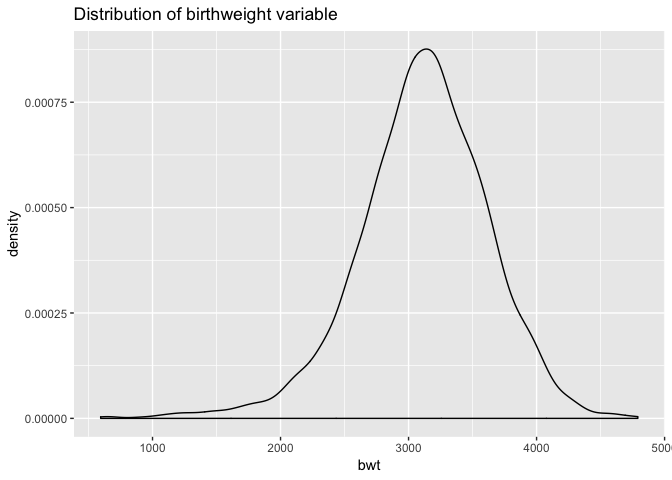

P8105\_hw6\_qs2200
================
Qi Shao
11/20/2018

Problem 1
---------

Tidy the data.

``` r
homi_df = read_csv("./data/homicide-data.csv") 
homi_df = 
  homi_df%>%
  mutate(city_state = str_c(city, ", ", state)) %>%
  janitor::clean_names() %>%
  mutate(homi_solved= ifelse(disposition == "Closed by arrest", 1, 0)) %>%
  filter(!(city_state %in%c("Dallas, TX", "Phoenix, AZ", "Kansas City, MO", "Tulsa, AL"))) %>%
  mutate(victim_race = ifelse(victim_race == "White", "white", "non-white"), victim_age = as.integer(victim_age), victim_race = fct_relevel(victim_race, "white", "non-white")) 
```

    ## Warning in evalq(as.integer(victim_age), <environment>): NAs introduced by
    ## coercion

``` r
balti_model = homi_df %>%
  filter(city_state == "Baltimore, MD")

glm(homi_solved ~ victim_age + victim_sex + victim_race, data = balti_model, family = binomial()) %>%
broom::tidy() %>%
mutate(OR_estimate = exp(estimate), OR_conf_low = exp(estimate-qnorm(.975)*std.error), OR_conf_high = exp(estimate+qnorm(.975)*std.error)) %>%
filter(term == "victim_racenon-white") %>%
dplyr::select(term,OR_conf_low, OR_estimate, OR_conf_high) %>% 
knitr::kable(digits = 3)
```

| term                  |  OR\_conf\_low|  OR\_estimate|  OR\_conf\_high|
|:----------------------|--------------:|-------------:|---------------:|
| victim\_racenon-white |          0.313|         0.441|            0.62|

The result of linear model shows that the adjusted odds ratio of solved homicides in which the victim is non-white estimated to be 0.441 times the odds ratio of homicides in which the victim is white.

``` r
each_city = homi_df %>%
  group_by(city_state) %>%
  nest()

odds_glm = function(df){
  glm( homi_solved ~ victim_age + victim_sex + victim_race, data = df, family =     binomial())  %>%
  broom::tidy() %>%
  mutate(OR_estimate = exp(estimate), OR_conf_low =        exp(estimate-qnorm(.975)*std.error), OR_conf_high = exp(estimate+qnorm(.975)*std.error)) %>%
  filter(term == "victim_racenon-white") %>%
  dplyr::select(term,OR_conf_low, OR_estimate, OR_conf_high)
}

all_estimate = 
  mutate(each_city, or = map(data, odds_glm)) %>%
  dplyr::select(city_state, or) %>%
  unnest() %>%
  dplyr::select(-term)

all_estimate %>%
  mutate(city_state = fct_reorder(city_state, OR_estimate)) %>%
  ggplot(aes(x = city_state,y = OR_estimate)) + 
  geom_point() +
  geom_errorbar(aes(ymin = OR_conf_low,ymax = OR_conf_high))+
  geom_hline(yintercept = 1, alpha = 0.5, color = "red")+
  coord_flip()+
  theme_minimal()+
  labs(title = "Estimate and 95% CI of solving homicides odds ratio for each city", 
         x = "City and State", 
         y = "Solving homicides odds ratio comparing non-white victims to white victims") 
```


From the plot, we can see in most cities in the study, the estimate odds ratio of solving homicides comparing non-white victims to white victims is less than 1. It indicate that in most of the cities, homicides in which the victim is non-white are substantially less likely to be resolved that those in which the victim is white. There are also some cities in which CI of odds ratio including 1, and 3 of them have estimate odds ratio greater than 1. In these cities, homicides in which the victim is non-white are more likely to be resolved that those in which the victim is white.

Problem 2
---------

### Tidy the data

``` r
birthweight_df = read.csv("./data/birthweight.csv") 

birthweight_df = janitor::clean_names(birthweight_df) %>%
  dplyr::mutate(babysex = as.factor(as.character(babysex)), 
                frace = as_factor(as.character(frace)),
                mrace = as_factor(as.character(mrace)),
                malform = as_factor(as.character(malform))) %>%
  dplyr::select(bwt, everything())

skimr::skim(birthweight_df) 
```

    ## Skim summary statistics
    ##  n obs: 4342 
    ##  n variables: 20 
    ## 
    ## ── Variable type:factor ──────────────────────────────────────────────────────────────────────────────
    ##  variable missing complete    n n_unique                      top_counts
    ##   babysex       0     4342 4342        2         1: 2230, 2: 2112, NA: 0
    ##     frace       0     4342 4342        5 1: 2123, 2: 1911, 4: 248, 3: 46
    ##   malform       0     4342 4342        2           0: 4327, 1: 15, NA: 0
    ##     mrace       0     4342 4342        4 1: 2147, 2: 1909, 4: 243, 3: 43
    ##  ordered
    ##    FALSE
    ##    FALSE
    ##    FALSE
    ##    FALSE
    ## 
    ## ── Variable type:integer ─────────────────────────────────────────────────────────────────────────────
    ##  variable missing complete    n      mean     sd  p0  p25    p50  p75 p100
    ##     bhead       0     4342 4342   33.65     1.62  21   33   34     35   41
    ##   blength       0     4342 4342   49.75     2.72  20   48   50     51   63
    ##       bwt       0     4342 4342 3114.4    512.15 595 2807 3132.5 3459 4791
    ##     delwt       0     4342 4342  145.57    22.21  86  131  143    157  334
    ##   fincome       0     4342 4342   44.11    25.98   0   25   35     65   96
    ##  menarche       0     4342 4342   12.51     1.48   0   12   12     13   19
    ##   mheight       0     4342 4342   63.49     2.66  48   62   63     65   77
    ##    momage       0     4342 4342   20.3      3.88  12   18   20     22   44
    ##    parity       0     4342 4342    0.0023   0.1    0    0    0      0    6
    ##   pnumlbw       0     4342 4342    0        0      0    0    0      0    0
    ##   pnumsga       0     4342 4342    0        0      0    0    0      0    0
    ##      ppwt       0     4342 4342  123.49    20.16  70  110  120    134  287
    ##    wtgain       0     4342 4342   22.08    10.94 -46   15   22     28   89
    ##      hist
    ##  ▁▁▁▁▅▇▁▁
    ##  ▁▁▁▁▁▇▁▁
    ##  ▁▁▁▃▇▇▂▁
    ##  ▁▇▅▁▁▁▁▁
    ##  ▁▂▇▂▂▂▁▃
    ##  ▁▁▁▁▂▇▁▁
    ##  ▁▁▁▅▇▂▁▁
    ##  ▂▇▅▂▁▁▁▁
    ##  ▇▁▁▁▁▁▁▁
    ##  ▁▁▁▇▁▁▁▁
    ##  ▁▁▁▇▁▁▁▁
    ##  ▁▇▆▁▁▁▁▁
    ##  ▁▁▁▇▇▁▁▁
    ## 
    ## ── Variable type:numeric ─────────────────────────────────────────────────────────────────────────────
    ##  variable missing complete    n  mean   sd    p0   p25   p50   p75 p100
    ##   gaweeks       0     4342 4342 39.43 3.15 17.7  38.3  39.9  41.1  51.3
    ##     ppbmi       0     4342 4342 21.57 3.18 13.07 19.53 21.03 22.91 46.1
    ##    smoken       0     4342 4342  4.15 7.41  0     0     0     5    60  
    ##      hist
    ##  ▁▁▁▁▃▇▁▁
    ##  ▁▇▅▁▁▁▁▁
    ##  ▇▁▁▁▁▁▁▁

There are 4342 observations and 10 variables in this dataset. 4 factor variables are babysex, father race, mother race and presence of malformations. There are no missing value in this dataset.

### Propose a regression model

*Check the distribution of outcome*

``` r
birthweight_df %>%
  ggplot(aes(x = bwt)) + 
  geom_density() +
  labs(title = "Distribution of birthweight variable")
```

 We can see that the birth weight is approximately distributed normally, satisfying linear regression model assumption.

*Multicolinearity*

``` r
pairs(birthweight_df)
```

We could visualize the pairwise distribution of variables. And we can see the relationship between bwt and bhead/blength are in linear form.

There are also some pair of predictors shows linear relationship: bhead and blength, delwt and ppbmi, delwt and ppwt, ppbmi and ppwt. We should concern the multicolinearity of these predictors.

*Use backward elimination method to build a regression model, take out non-significant variables one at a time.*

``` r
mult.fit = lm(bwt ~ ., data = birthweight_df)
step(mult.fit, direction='backward')
```

``` r
fit_model1 = lm(bwt ~ babysex + bhead + blength + delwt + fincome + gaweeks + mheight + mrace + parity + ppwt + smoken, data = birthweight_df)
summary(fit_model1)
```

    ## 
    ## Call:
    ## lm(formula = bwt ~ babysex + bhead + blength + delwt + fincome + 
    ##     gaweeks + mheight + mrace + parity + ppwt + smoken, data = birthweight_df)
    ## 
    ## Residuals:
    ##      Min       1Q   Median       3Q      Max 
    ## -1097.18  -185.52    -3.39   174.14  2353.44 
    ## 
    ## Coefficients:
    ##               Estimate Std. Error t value Pr(>|t|)    
    ## (Intercept) -6098.8219   137.5463 -44.340  < 2e-16 ***
    ## babysex2       28.5580     8.4549   3.378 0.000737 ***
    ## bhead         130.7770     3.4466  37.944  < 2e-16 ***
    ## blength        74.9471     2.0190  37.120  < 2e-16 ***
    ## delwt           4.1067     0.3921  10.475  < 2e-16 ***
    ## fincome         0.3180     0.1747   1.820 0.068844 .  
    ## gaweeks        11.5925     1.4621   7.929 2.79e-15 ***
    ## mheight         6.5940     1.7849   3.694 0.000223 ***
    ## mrace2       -138.7925     9.9071 -14.009  < 2e-16 ***
    ## mrace3        -74.8868    42.3146  -1.770 0.076837 .  
    ## mrace4       -100.6781    19.3247  -5.210 1.98e-07 ***
    ## parity         96.3047    40.3362   2.388 0.017004 *  
    ## ppwt           -2.6756     0.4274  -6.261 4.20e-10 ***
    ## smoken         -4.8434     0.5856  -8.271  < 2e-16 ***
    ## ---
    ## Signif. codes:  0 '***' 0.001 '**' 0.01 '*' 0.05 '.' 0.1 ' ' 1
    ## 
    ## Residual standard error: 272.3 on 4328 degrees of freedom
    ## Multiple R-squared:  0.7181, Adjusted R-squared:  0.7173 
    ## F-statistic: 848.1 on 13 and 4328 DF,  p-value: < 2.2e-16

The result of backward stepwise selection have 11 predictors.

*Diagnose*

``` r
par(mfrow = c(2,2))
plot(fit_model1)
```

 We can see the model fits well.

``` r
birthweight_df %>%
  modelr::add_residuals(fit_model1) %>% 
  modelr::add_predictions(fit_model1) %>% 
  ggplot(aes(x = pred, y = resid)) + 
  geom_point(alpha = .4)+
  geom_hline(yintercept = 0, color = "red") +
  ggtitle("Residuals vs Fitted value")
```


``` r
fit_model2 = lm(bwt ~ blength + gaweeks, data = birthweight_df)
summary(fit_model2)
```

    ## 
    ## Call:
    ## lm(formula = bwt ~ blength + gaweeks, data = birthweight_df)
    ## 
    ## Residuals:
    ##     Min      1Q  Median      3Q     Max 
    ## -1709.6  -215.4   -11.4   208.2  4188.8 
    ## 
    ## Coefficients:
    ##              Estimate Std. Error t value Pr(>|t|)    
    ## (Intercept) -4347.667     97.958  -44.38   <2e-16 ***
    ## blength       128.556      1.990   64.60   <2e-16 ***
    ## gaweeks        27.047      1.718   15.74   <2e-16 ***
    ## ---
    ## Signif. codes:  0 '***' 0.001 '**' 0.01 '*' 0.05 '.' 0.1 ' ' 1
    ## 
    ## Residual standard error: 333.2 on 4339 degrees of freedom
    ## Multiple R-squared:  0.5769, Adjusted R-squared:  0.5767 
    ## F-statistic:  2958 on 2 and 4339 DF,  p-value: < 2.2e-16

``` r
fit_model3 = lm(bwt ~ bhead + blength + babysex + bhead*blength + bhead*babysex + blength*babysex + bhead*blength*babysex, data = birthweight_df)
summary(fit_model3)
```

    ## 
    ## Call:
    ## lm(formula = bwt ~ bhead + blength + babysex + bhead * blength + 
    ##     bhead * babysex + blength * babysex + bhead * blength * babysex, 
    ##     data = birthweight_df)
    ## 
    ## Residuals:
    ##      Min       1Q   Median       3Q      Max 
    ## -1132.99  -190.42   -10.33   178.63  2617.96 
    ## 
    ## Coefficients:
    ##                          Estimate Std. Error t value Pr(>|t|)    
    ## (Intercept)            -7176.8170  1264.8397  -5.674 1.49e-08 ***
    ## bhead                    181.7956    38.0542   4.777 1.84e-06 ***
    ## blength                  102.1269    26.2118   3.896 9.92e-05 ***
    ## babysex2                6374.8684  1677.7669   3.800 0.000147 ***
    ## bhead:blength             -0.5536     0.7802  -0.710 0.478012    
    ## bhead:babysex2          -198.3932    51.0917  -3.883 0.000105 ***
    ## blength:babysex2        -123.7729    35.1185  -3.524 0.000429 ***
    ## bhead:blength:babysex2     3.8781     1.0566   3.670 0.000245 ***
    ## ---
    ## Signif. codes:  0 '***' 0.001 '**' 0.01 '*' 0.05 '.' 0.1 ' ' 1
    ## 
    ## Residual standard error: 287.7 on 4334 degrees of freedom
    ## Multiple R-squared:  0.6849, Adjusted R-squared:  0.6844 
    ## F-statistic:  1346 on 7 and 4334 DF,  p-value: < 2.2e-16

``` r
set.seed(1)
cv_df = 
  crossv_mc(birthweight_df, 100)%>%
  mutate(train = map(train, as_tibble),
         test = map(test, as_tibble)) %>%
  mutate(fit_model1 = map(train, ~lm(bwt ~ babysex + bhead + blength + delwt + fincome + gaweeks + mheight + mrace + parity + ppwt + smoken, data = .x)),
         fit_model2 = map(train, ~lm(bwt ~ blength + gaweeks,data = .x)),
         fit_model3 = map(train, ~lm(bwt ~ bhead + blength + babysex + bhead*blength + bhead*babysex + blength*babysex + bhead*blength*babysex, data = .x))) %>% 
  mutate(rmse_model1 = map2_dbl(fit_model1, test, ~rmse(model = .x, data = .y)),
         rmse_model2 = map2_dbl(fit_model2, test, ~rmse(model = .x, data = .y)),
         rmse_model3 = map2_dbl(fit_model3, test, ~rmse(model = .x, data = .y)))
```

    ## Warning in predict.lm(model, data): prediction from a rank-deficient fit
    ## may be misleading

    ## Warning in predict.lm(model, data): prediction from a rank-deficient fit
    ## may be misleading

``` r
cv_df %>% 
  dplyr::select(starts_with("rmse")) %>% 
  gather(key = model, value = rmse) %>% 
  mutate(model = str_replace(model, "rmse_", ""),
         model = fct_inorder(model)) %>% 
  ggplot(aes(x = model, y = rmse)) + geom_violin()
```


